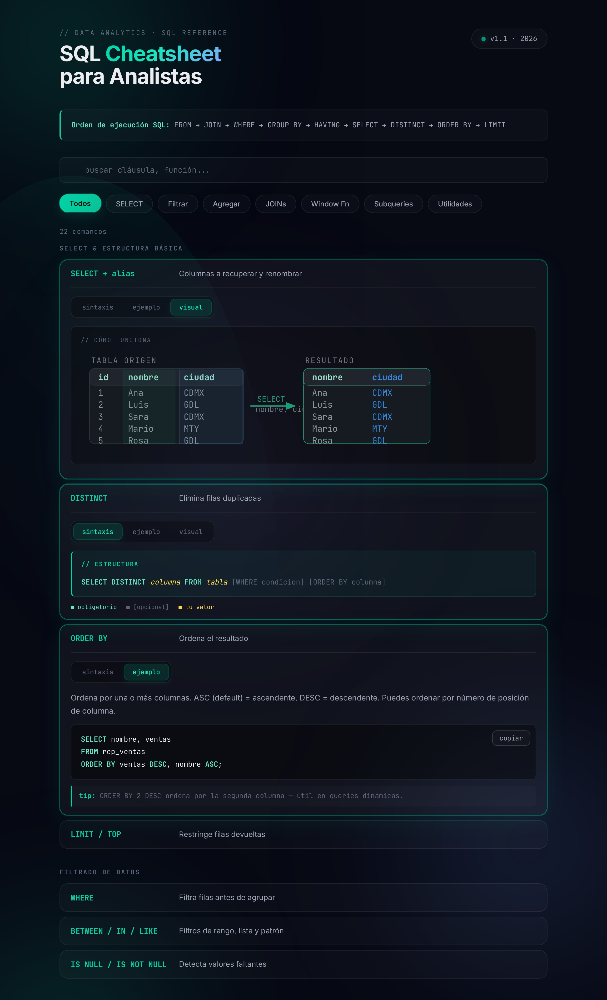

# SQL Cheatsheet para Analistas de Datos

> Cheatsheet interactivo de SQL diseñado para analistas de datos junior: sintaxis estructurada, ejemplos copiables y diagramas visuales de cada cláusula y función.



## ¿Qué incluye?

El proyecto tiene **dos páginas conectadas entre sí**:

### Cheatsheet (`index.html`)

- **22 cláusulas y funciones** organizadas por categoría: SELECT, filtrado, agregación, JOINs, window functions, subqueries y utilidades.
- **3 vistas por comando**: sintaxis estructurada, ejemplo de código copiable y diagrama visual SVG de cómo funciona.
- **Buscador en vivo** + filtros por categoría.

### Ejercicios prácticos (`ejercicios.html`)

- **3 casos de análisis con dificultad progresiva** (básico → intermedio → avanzado) sobre dominios reales: e-commerce, marketing y SaaS.
- **Editor SQL real**: escribe consultas y ejecútalas contra una base SQLite cargada 100% en tu navegador (vía `sql.js`) — sin servidor, sin backend.
- Cada caso incluye contexto de negocio, esquema de datos, **2-3 preguntas analíticas**, pistas, solución comentada e **interpretación analítica** de cada resultado.
- **Resaltado de sintaxis** en el editor que diferencia palabras clave, funciones, strings, números y comentarios.

## Cómo usarlo

### Opción A - Abrir localmente

```bash
git clone https://github.com/RobertoBG1111/sql-cheatsheet-data-analyst.git
cd sql-cheatsheet-data-analyst
```

Después abre `index.html` en tu navegador y navega a los ejercicios desde el botón del header. Listo.

### Opción B - Versión online (GitHub Pages)

Una vez publicado el repo:

`https://robertobg1111.github.io/sql_reference_data_analytics/`

Para activar Pages: **Settings → Pages → Source: `main` / root → Save.**

## Sobre este proyecto

Este proyecto forma parte de mi **portafolio de Data Analytics**. Empezó como un cheatsheet para consolidar mis apuntes de SQL y tener una referencia visual rápida; la página de ejercicios prácticos es el siguiente paso: pasar de "consultar la sintaxis" a "aplicarla a problemas de negocio reales", uniendo el dominio técnico con el criterio analítico.

> **Sobre el desarrollo**: me apoyé en inteligencia artificial (Claude, de Anthropic) como copiloto durante la construcción de esta herramienta — para acelerar el diseño de la interfaz, generar los diagramas SVG y depurar el JavaScript. La curación del contenido SQL, las decisiones de qué incluir y los criterios pedagógicos vienen de mi experiencia consolidando apuntes como analista. Creo que ser transparente sobre el uso de IA es parte de la práctica profesional moderna en data.

## Otros proyectos del portafolio

**GitHub**: [github.com/RobertoBG1111](https://github.com/RobertoBG1111)

## Contacto

- **LinkedIn**: [linkedin.com/in/robertobarreragarcia](https://www.linkedin.com/in/robertobarreragarcia)
- **GitHub**: [@RobertoBG1111](https://github.com/RobertoBG1111)

## Licencia

MIT © 2026 Roberto Barrera García - ver [LICENSE](LICENSE).
